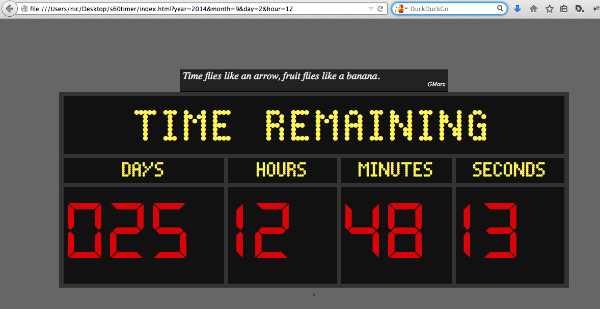

Studio 60's countdown clock
=================================

A countdown clock for your browser, likened to the one in the TV show ["Studio 60 on the Sunset Strip"](http://www.imdb.com/title/tt0485842/).
Written by [Nic](http://www.nicolashoening.de/) and [Jan](http://www.yanzen.de/).

Inspired by [Wes Mendell](http://en.wikipedia.org/wiki/Wes_Mendell)'s crazy countdown clock in [Studio 60](http://en.wikipedia.org/wiki/Studio_60_on_the_Sunset_Strip).
Set your own deadline and see it being counted down!

Simply point your browser to `index.html` and provide any of these URL parameters:

* title (default, as in the TV show, is "TIME REMAINING")
* year
* month
* day
* hour
* minute

In order to look like it should (see above), the clock thankfully uses the fonts

* [Dot Matrix](Studio 60 on the Sunset Strip) by [Svein Kåre Gunnarson](http://www.dionaea.com/information/fonts.html)
* [Digit](http://www.dafont.com/digit.font) (by paldave)
